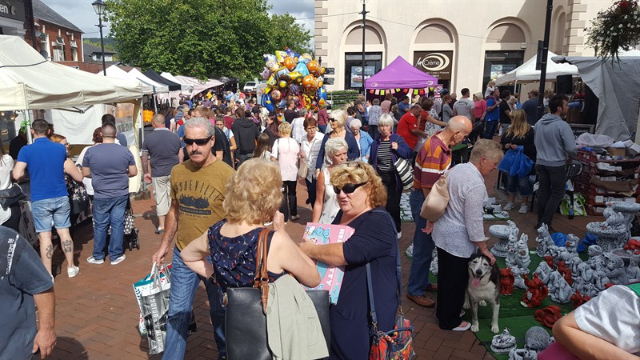
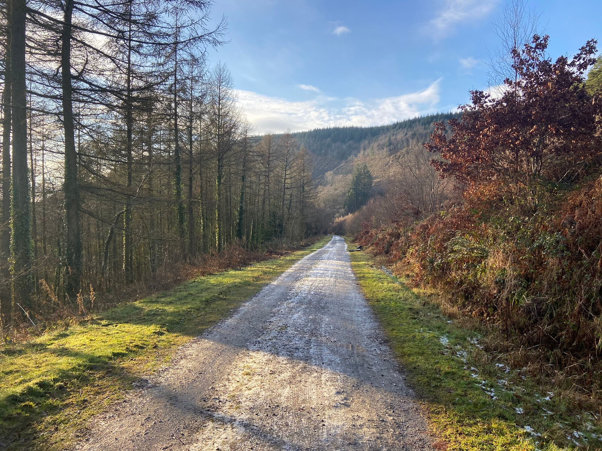

class:hide_logo middle, center
background-image: url(images/DataConnect23_Housekeeping.jpg)
background-position: 50% 50%
background-size: contain

```{r setup, include=FALSE}
library(xaringanExtra)
library(leaflet)
options(htmltools.dir.version = FALSE)


```

```{css, echo=FALSE}
.link-style1 a {
  color: blue;
  text-decoration: underline;
}

.link-style2 a {
 color: blue;
}


```

```{r xaringan-logo, echo=FALSE}
xaringanExtra::use_logo(
  image_url = "images/npt_dc23_logo_combined.png",
  width = "150px",
  height = "200px",
  position=css_position(top = NULL, right = NULL, left = "1em", bottom = "-6em")
)

```
???
Let's stand on ceremony first. If you've gone to previous dataconnect23 presentations, you will have seen this before; in a nutshell, if you haven't already or might've forgotten please turn your microhphone off just in case my voice doesn't come across. Any questions, send them to the teams chat and I will eventually tend to them with the help of my colleagues.
---
class: hide_logo, middle, center

# <span style="font-size:38px;color:#50ab44">Leveraging Address Data in a Local Authority Council</span>

## <span style="font-size:32px;color:#0595c7"> Tanaka Takawira - Senior Data Analyst</span>

.image-nptcbc[]

## Dr. Yasmin Friedmann - Head of Data
## Rhiannon Elias - Data Analyst

???
I'll be talking about our adventure in leveraging address data in a local authority council in South Wales, Neath Port Talbot. While I'll be leading the presentation, I'm joined by my colleagues [name them] who have contributed massively in the pieces of work I'll be talking about.
---
# Neath
???
So, personally, some things I like about Neath that I would tell someone else about are.

--

## Neath September Fair 


???
I believe it's the oldest running fair in Europe, having started some 700 years ago.

---
# Spoilt for outdoor activity!

## Beach


???
I like going to the beach when the weather's ambient like pictured (so nut just sunny), There's lots to do round there, for me, that includes fishing off the beach.
---
# Spoilt for outdoor activity!

???
it goes on! Afan Forest is great for cycling and walking. Some proof there, that the sun does shine.


## .center[Afan Forest] 
.center[.image-afan[]]


---
#Aims

--

## Discuss

???
Just read slides verbatim
--

   <br>
 + Embedding Address Data Standards
   <br>
   <br>

--
   
 + What we've done, Where we are going and what we're aiming for
   <br>
   <br>
   
--
   
 + Methods/Tools we use
 
???
We'll get a little bit technical for this one

--
<br>
<br>
<br>
<br>
<br>

## Invite Contribution from peers, share experiences and good practice

???
Our team is new in the address data journey,

---

class: center, middle

# Embedding Data Standards

---
# What Address Data Standards?

## GeoPlace

--

* Source of UK Address Data Standards

--

- Central source for UK addresses and streets, working with over 300 councils across England and Wales which have a statutory responsibility for approving and creating addresses. 46.5 million addresses, 2 million records update monthly. 

--

<ins>Stringent data quality process</ins>

- Matches against records from several authoritative government property/address databases.

- Validation and assurance process that runs 100s of checks on each record before being accepted into the database.

--

- Data is enriched and transformed by adding best attributes from source datasets to enhance quality of overall product.

- The Unique Property Reference Number (UPRN) is the unique identifier for every addressable location across the UK.

---


# Situation

--

## Large volume of Address Data

NPTCBC has approximately 350 known applications, many using address data. Address data exists in many forms across the council including spreadsheets and word documents across departments including Social Care, Environment, Digital Services.

???
(after reading) Wealth of address data being used

--


## Standards
There is a tremendous opportunity for an agreed/mandated address data standard to be put in place across the council for the first time. This includes ubiquity of recording/validating addresses and the concepts of UPRN and USRN, emanating from a central address repository known to most (if not all) who record addresses.
<!-- ## Accessiblity -->
<!-- Address data can be used by a wide variety of different applications, that may be known to exist by a few people or the address data is hard to share.  -->
--

## Quality
Address Data in the council meets varying degrees of fitness for purpose. There's also a tremendous opportunity to elevate the breadth and depth of understanding the address data quality across the council. 

---
<style>
.remark-slide-content {
  padding-top: -20px;
  padding-left: -20px;
  padding-right: -20px;
  padding-bottom: -20px
}
</style>
# Motivation - Embedding Data Standards would improve:

--

## Staff awareness

Promotion of the concept of a standardised address format, and signposting to training resources would dissemminate the established address data standards. Staff awareness will improve quality of address data inputted by causing people to be more careful.

???
***Staff Awareness*** -  Benefits of awareness depends on person, if it's on digital services, anytime we write a program that accepts address will always be dropdown and not free text. This is for people who create apps
For people who input data, if they're aware of importance of standards, will be more aware when inputting data, will be more careful to write in correct standard and write UPRN. 

--

## Data Quality

Ascribing to these data standards would ensure fitness for purpose of addresss data across many applications, increase options to leverage the data and reduce time to understand data.

???
***Data Quality*** Source of data will always be geoplace - people always refer to that. Wherever someone can see an address they can access LLPG or Geoplace

--
<p style="text-align: center;color:#0595c7"><ins>Example</ins></p>
.pull-left[
.image-ryl_ml_ltr_exmpl[]
]

.pull-right[Royal Mail require the following to deliver letters in expected time frames:
* 1 premise element
* 1 thoroughfare element
* 1 locality element
* the postcode as a minimum

Many departments may have difficulty getting information to people for addresses that don't meet this.
]


???
***Example*** - Helps deliver apps objectives. Probably critical that quality of address data is high. 

---

# Motivation - Embedding Data Standards would improve (Part 2):

## Data Linkage

Integration of all current applications that use addresses within the council with the LLPG for local addresses and NPG for national addresses. The integration will add UPRN, USRN, and possibly other useful data to any of the datasets, enabling linkage across teams and enabling sharing of data. UPRN is gold standard, various data quality analysis/measurements fills the gap. 


???
Once we have done embedding, we will be able to link on an address. We can't know where it's gonna be helpful because we don't know the work.
But having that there makes us more resilient to any change in the future. 

--

## Have you had to link an address? Why?


---

# What are we Doing/Aiming to do? Part 1

--

## Self-Service Address App
--

 + Single point of contact that unifies many ad-hoc queries around address data

--

* Prescriptive approach to capturing new addresses.

 + we create the way data is presented and standardised, eg getting new address to send in a letter format.


--


* User centered designed access to suit of address products/standards

 + OS Data Hub, LLPG, Royal Mail - PAF, Metadata repository.
 
--

<br> 
* What would you like to see in such a self-service address data dashboard/app?

--

 + What other dashboard would you need?
 

---
<style>

.remark-slide-content > h1:first-of-type {   font-size: 5px;   margin-top: -250px; }

.remark-slide-content {
  padding-top: -100px;
  padding-left: -100px;
  padding-right: -100px;
  padding-bottom: -100px;
}

</style>
# What are we Doing/Aiming to do? Part 2

--

## Champion

Promote the concept of a standardized address format to all staff, and signpost to training resources.

--


## Standard Operating Procedure (SOP)
Create an SOP of how to record and validate addresses, UPRNs and USRNs in the day-to-day work on spreadsheets or similar until automation. 

--

## Data Linking
Linking datasets across various domains so that the council can have a broader view of council residents' experience. 

--

## Data Quality Assessments

Using the data quality dimensions from the Data Quality Hub, we have commenced some Data Quality Reports on address datasets within various domains across the business. This is helping us understand the data quality and the cost/benefit on various data quality improvement actions such as data cleaning or address matching to a UPRN. For example, de-duplicating and completeness (eg, filling in missing towns in otherwise complete addresses)
---

# Examples so Far

## Expansion letters
A key unit within NPTCBC needed to distribute letters to particular areas of deprivation. 

* Programmatically generated list of addresses from postcodes.
* OS Data HUB APIs and LLPG used as data sources
* Address letter outputs matched to 
.link-style1[[Royal Mail’s Postcode Address File (PAF)](https://www.poweredbypaf.com/)] and 7 line address format of .link-style1[[UK Gov Notify](https://www.notifications.service.gov.uk/)]
* Benefits:
 +	Saved a lot of time to offices themselves and this is easily reproducible [and they will]
 +	Make sure that addresses are correct and we're saving time and errors with addressing.


--

## Data Quality Assessments
We have programmatically produced data quality assessment reports on the address data of various areas, such as social care.
  * Data quality Dimensions
  * give view of fitness for purpose

---
class: center, middle

# Methods/Tools we use

---

# Address Matching Algorithms


--

* It's easy to standardise new addresses - EG, source from OS AddressBase

--

* Enhancing quality of current/historic addresses is a challenge. EG, linking with OS AddressBase. 

.image-adrsalg[.center[]]
.center[.link-style1[[by Placekey](https://www.placekey.io/blog/address-matching#:~:text=One%20of%20the%20easiest%20ways,second%20character%2C%20and%20so%20on.)]]

--

## Literature Review
  
*   ASSIGN, OS Places API, addressMatchR,IdoxMatch's Aligned Assets platform, ONS address index (AI) project

???
This is where we've got to so far

---

# Application Programing Interfaces (APIs)

.image-api[.center[]]

???
explain what API diagram above. IE, compare to waiter part below and end with "well why is that better than just going to the kitchen and asking the chef for the order yourself or even cook it yourself? Save hassle from the middle layers? *Start with security()
--

* The way we interact with Geoplace Address data through OS AddressBase Data Hub (APIs)

???
Why is this relevant? - It's the way we interact to database.

--

* **Advantages** - Security, Flexibility, Scalability, Ease of Use, Interoperability,

???
* ***Security*** - layer of protection between yourself and the database -> works both ways, people can't mess around in the database and we don't have to drop access layers to access data.

* ***flexibility*** -  If data behind the API were to change, it wouldn't necessarily mean a change in how you request the data.

* ***Scalability*** - It scales well. We're not storing data and they're designed for multiple heavy use.

* ***Ease of Use*** - With regards to data, requests are simply web links with parameteres in them. 

* ***Interoperability***  - can use across a range of programming languages/ It's a simple interface. standardised RESTful procedure.

--


* **Disadvantages** - Increased design Complexity, Web Connection, Variable performance and flexibility

???
* ***Increased Design Complexity*** Easier to use but more effort to design than sharing a database connection
* ***Web Connection*** Firewalls or even service disruptions to internet can  compromise functionality.
* ***Variable performance and flexibility*** Not all APIs are created equally!

---
<style>

.remark-slide-content > h1 {   font-size: 35px;   margin-top: -250px; }

</style>
# Tools we use
<!-- Default css theme in YAML needed for pull-left/pull-right to work -->

--


.pull-left[

## Rstudio

``` {r posit_image,echo=FALSE,  out.height = "100px", out.width = "100px"}
knitr::include_graphics("https://upload.wikimedia.org/wikipedia/commons/thumb/1/1b/R_logo.svg/1280px-R_logo.svg.png")
```


]

--

.pull-right[

## Python

``` {r python_image,echo=FALSE, out.height = "100px", out.width = "100px"}
knitr::include_graphics("https://upload.wikimedia.org/wikipedia/commons/thumb/c/c3/Python-logo-notext.svg/800px-Python-logo-notext.svg.png")
```

]

--
<p style="text-align: center;color:#0595c7"><ins>Why?</ins></p>
--
.left-column[
* Experience

* Mature

* Open-Source

* Powerful

* Capability

 + It produced this presentation !
]

--

.right-column[

```{r out.width='100%', fig.height=2, fig.width=2}
library(leaflet)
leaflet() %>% addTiles() %>%
  setView(-3.8283643,51.6248032, zoom = 16.5)
```

]

---
class: middle, center
# Interaction/Questions

---
class: middle, center
background-image: url(images/NPTCBC_color_grad_bkgrnd.png)

# <span style="color:white">Thanks!</span>  

<span style="color:white">slides and contact details available .link-style1[[on github](https://github.com/TNTgithubNPT/DataConnect23---Leveraging-Address-Data-in-LA-Council)]
