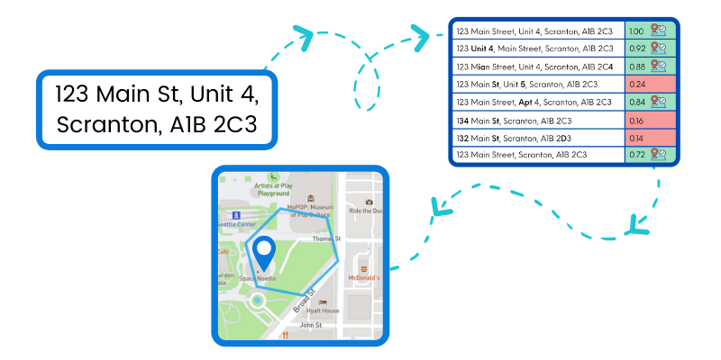

<!-- Commented out yaml saved for later -->
<!-- output: -->
<!--   xaringan::moon_reader: -->

<!--     nature: -->
<!--       countIncrementalSlides: false -->
<!--       titleSlideClass: ["left", "middle", "inverse"] -->
<!--       highlightLines: true -->
<!--       highlightStyle: solarized-dark -->
<!--     includes: -->
<!--       in_header: header.html -->

# Topics

## Setting and embedding Data Standards

## Attaching UPRN to addresses using Machine-Learning

## Open-Source tools to solve common challenges involving address data


```{r setup, include=FALSE}
library(xaringanExtra)
library(leaflet)
options(htmltools.dir.version = FALSE)


```

```{r xaringan-logo, echo=FALSE}
xaringanExtra::use_logo(
  image_url = "https://mminpt.co.uk/wp-content/uploads/2018/10/nptcbc.jpg",
  position=css_position(top = NULL, right = NULL, left = "1em", bottom = "-1.5em")
)
```


---

class: center, middle

# Setting and embedding Data Standards

---

# Situation

--

## Large volume of Data

--

## Disjointed

--

## Accessiblity

--

## Quality

---

# Motivation

--

## Setting Data Standards would improve

--

### Accessibility of Data

--

### Data Linkage

--

* Internal

--

- External

---
class: middle, center

# Embedding Address Data Standards

--

## GeoPlace/OS AddressBase

--

- Local Land and Property Gazetteer

--

- OS Data Hub

--

## NUAR - MUDDY standards

--

## PAF - Royal Mail, INSPIRE

--

## Metadata Repository

---

# Attaching UPRN to addresses using Machine-Learning

--

## Unique Property Reference Number (UPRN)

--

## Address-Matching Algorithms

---

# Address-Matching Algorithms



---

# Literature Review

--

## ASSIGN 

--

## OS Places API

--

## addressMatchR

--

## IdoxMatch's Aligned Assets platform

--

## ONS address index (AI) project

---

# Analytical tools for our challenges with Address Data
<!-- Default css theme in YAML needed for pull-left/pull-right to work -->

--


.pull-left[

## Posit

``` {r posit_image,echo=FALSE,  out.height = "100px", out.width = "100px"}
knitr::include_graphics("https://upload.wikimedia.org/wikipedia/commons/thumb/1/1b/R_logo.svg/1280px-R_logo.svg.png")
```


]

--

.pull-right[

## Python

``` {r python_image,echo=FALSE, out.height = "100px", out.width = "100px"}
knitr::include_graphics("https://upload.wikimedia.org/wikipedia/commons/thumb/c/c3/Python-logo-notext.svg/800px-Python-logo-notext.svg.png")
```

]

---
# Why?


.left-column[
## Experience


## Open-Source

## Capability
]


.right-column[

```{r out.width='100%', fig.height=4, fig.width=4}
library(leaflet)
leaflet() %>% addTiles() %>%
  setView(-93.65, 42.0285, zoom = 17)
```

]

---
# Other Tools

--
.pull-left[

## PostGIS

``` {r postgis,echo=FALSE,  out.height = "100px", out.width = "100px"}
knitr::include_graphics("https://upload.wikimedia.org/wikipedia/en/6/60/PostGIS_logo.png")
```


]

--

.pull-right[

## ArcGis/QGis
.pull-left[
``` {r arcgis,echo=FALSE, out.height = "100px", out.width = "100px"}
knitr::include_graphics("https://upload.wikimedia.org/wikipedia/commons/thumb/d/df/ArcGIS_logo.png/180px-ArcGIS_logo.png")
```
]

.pull-right[
``` {r Qgis,echo=FALSE, out.height = "100px", out.width = "100px"}
knitr::include_graphics("https://upload.wikimedia.org/wikipedia/commons/thumb/c/c2/QGIS_logo%2C_2017.svg/1920px-QGIS_logo%2C_2017.svg.png")
```
]
]

---
class: middle, center
background-image: url(images/NPTCBC_color_grad_bkgrnd.png)

# <span style="color:white">Thanks!</span>  

<span style="color:white">slides and contact details available github.com/...(?)</span>  
