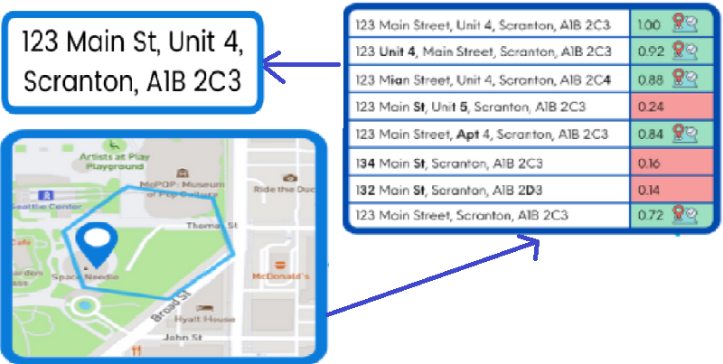

class: middle, center
<style>

.remark-slide-content > h1 {
  font-size: 40px;
  color: #50ab44 /*hex key for darkest greenest colour in NPT logo */
}
.remark-slide-content > h2 {
  font-size: 28px;
  color: #0595c7 /*hex key for darkest bluest colour in NPT logo */
}

</style>

# Topics

--


## Embedding Address Data Standards

--

## Attaching UPRN to addresses using Machine-Learning

--

## Tools we use


```{r setup, include=FALSE}
library(xaringanExtra)
library(leaflet)
options(htmltools.dir.version = FALSE)


```

```{r xaringan-logo, echo=FALSE}
xaringanExtra::use_logo(
  image_url = "https://mminpt.co.uk/wp-content/uploads/2018/10/nptcbc.jpg",
  position=css_position(top = NULL, right = NULL, left = "1em", bottom = "-1.5em")
)
```


---

class: center, middle

# Embedding Data Standards

---
# What Address Data Standards?

--

## GeoPlace

--

- central source for UK addresses and streets, working with over 300 councils across England and Wales which have a staturoy responsibility for approving and creating addresses. 46.5 million addresses, 2 million records update monthly. 

--

<ins>Stringent data quality process</ins>

- Match against records from several authoritative government property/address databases.

- Validation and assurance process that runs 100s of checks on each record before being accepted into the database.

--

- Data is enriched and transformed by adding best attributes from source datasets to enhance quality of overall product.

- The Unique Property Reference Number (UPRN) is the unique identifier for every addressable location across the UK. Every addressable location in Great Britain is uniquely identified by the Unique Property Reference Number (UPRN). 

---
class: center, middle

# Situation

--

## Large volume of Address Data

Councils have a large number of different departments, including Social Care, Environment, Digital Services.
Address data is vital to the delivery of all these functions. We do not know the depth and breadth of applications that use address data and how they use address data. 

--

## Disjointed

Duplicate Address data held in different places, with no immediate way to link across departments. 
--

## Accessiblity
Address data can be used by a wide variety of different applications, that may be known to exist by a few people or the address data is hard to share. 
--

## Quality
Address Data in the council meets varying degrees of fitness for purpose. We don't know the full picture of address data quality across the council.

---
class: middle, center

# Motivation - Embedding Data Standards would improve

--

## Accessibility of Data

--

## Data Linkage

--

Internal/External

---
class: middle, center

# Embedding Address Data Standards

--

## GeoPlace/OS AddressBase

--

- Local Land and Property Gazetteer

--

- OS Data Hub

--

## NUAR - MUDDY standards

--

## PAF - Royal Mail, INSPIRE

--

## Metadata Repository

---

# Attaching UPRN to addresses using Machine-Learning

--

## Unique Property Reference Number (UPRN)

--

## Address-Matching Algorithms

---

# Address-Matching Algorithms



---

# Literature Review

--

## ASSIGN 

--

## OS Places API

--

## addressMatchR

--

## IdoxMatch's Aligned Assets platform

--

## ONS address index (AI) project

---

# Analytical tools for our challenges with Address Data
<!-- Default css theme in YAML needed for pull-left/pull-right to work -->

--


.pull-left[

## Posit

``` {r posit_image,echo=FALSE,  out.height = "100px", out.width = "100px"}
knitr::include_graphics("https://upload.wikimedia.org/wikipedia/commons/thumb/1/1b/R_logo.svg/1280px-R_logo.svg.png")
```


]

--

.pull-right[

## Python

``` {r python_image,echo=FALSE, out.height = "100px", out.width = "100px"}
knitr::include_graphics("https://upload.wikimedia.org/wikipedia/commons/thumb/c/c3/Python-logo-notext.svg/800px-Python-logo-notext.svg.png")
```

]

---
# Why?


.left-column[
## Experience


## Open-Source

## Capability
]


.right-column[

```{r out.width='100%', fig.height=4, fig.width=4}
library(leaflet)
leaflet() %>% addTiles() %>%
  setView(-93.65, 42.0285, zoom = 17)
```

]

---
# Other Tools

--
.pull-left[

## PostGIS

``` {r postgis,echo=FALSE,  out.height = "100px", out.width = "100px"}
knitr::include_graphics("https://upload.wikimedia.org/wikipedia/en/6/60/PostGIS_logo.png")
```


]

--

.pull-right[

## ArcGis/QGis
.pull-left[
``` {r arcgis,echo=FALSE, out.height = "100px", out.width = "100px"}
knitr::include_graphics("https://upload.wikimedia.org/wikipedia/commons/thumb/d/df/ArcGIS_logo.png/180px-ArcGIS_logo.png")
```
]

.pull-right[
``` {r Qgis,echo=FALSE, out.height = "100px", out.width = "100px"}
knitr::include_graphics("https://upload.wikimedia.org/wikipedia/commons/thumb/c/c2/QGIS_logo%2C_2017.svg/1920px-QGIS_logo%2C_2017.svg.png")
```
]
]

---
class: middle, center
background-image: url(images/NPTCBC_color_grad_bkgrnd.png)

# <span style="color:white">Thanks!</span>  

<span style="color:white">slides and contact details available github.com/...(?)</span>  
